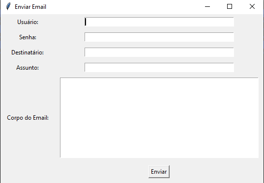

# Snacksphere

### Instalação:
Para Usar o aplciativo você precisará do [python](https://www.python.org/downloads/) para conseguir executar
> Lembre-se de selecionar para instalar o pip e deixar-lo como variável de ambiente(Isso se faz no própio intalador).

Com o python instalado siga os seguintes passos:

- Clone o repositório executando no shell do seu computador o comando: ```Git clone https://github.com/ThlagoCruz/SnackSphere```
> Para clonar o repositório é necessário o git. Caso não tenha instale [aqui](https://github.com/git-for-windows/git/releases/download/v2.45.2.windows.1/Git-2.45.2-64-bit.exe)

- Vá para o ditetório usuários(C:\Users\Seu-Usuário\SnackSphere)

- Instale o sqlite
>[Vídeo explicando como instalar](https://www.youtube.com/watch?v=gsZmB_MMKyc)

- Instale o [db Browser](https://download.sqlitebrowser.org/DB.Browser.for.SQLite-3.12.2-win64.msi) (Opicional)

- Execute o arquivo setup.bat que vem junto com o programa.

---
# Ferramentas🛠:

### Envio de E-Mails:

Para usar a ferramenda de enviar emails você precisa seguir alsuns passos:
- Ter uma conta gmail
> Caso não tenha a conta gmail [crie uma](https://mail.google.com/)

- Preencha os campos na seguinte tela: 

>Lembre-se de ao invéis de usar sua senha gmail usar a senha de app. Caso não tenha uma crie uma [aqui!](https://myaccount.google.com/apppasswords)

- E pronto! Seu email foi enviado. 

>*PS: Caso ocorra algum erro contate o desenvolvedor!*
---
### Usuários
Por padrão o SnackSphere vem com o usuário Root e com a senha 123. Mas você pode mudar o nome e a senha dentro do aplicativo.
>Para fazer isso selecione a opção 11 para nome e 12 para senha
---

# Importações

As importações são ferramentas para facilitar inserir dados as tabelas. segue os passo a passo para importar arquivos corretamenta ao SnackSphere:

- Crie um json, excel ou csv
>no exemplo será usado json.

- Leve o arquivo para a pasta Uploads 
>Visualização no windows explorer:
---
> 

- Após enviar o arquivo para a pasta \Uploads mude o nome dela de acordo com a tabela:

|Nome do arquivo|Extensão|
|---------------|--------|
|json|.json|
|csv|.csv|
excel|.xlsx


- Selecione a opção referente ao tipo de arquivo importado.
- E por fim selecione se irá usar tabela de fornecedores(F) ou de produto(P)
---
# Filtros
O SnackSphere oferece diversos filtros de email, contato, preço e diversos outros.
Para usar-los é necessário apenas selecionar a opção referente ao filtro.